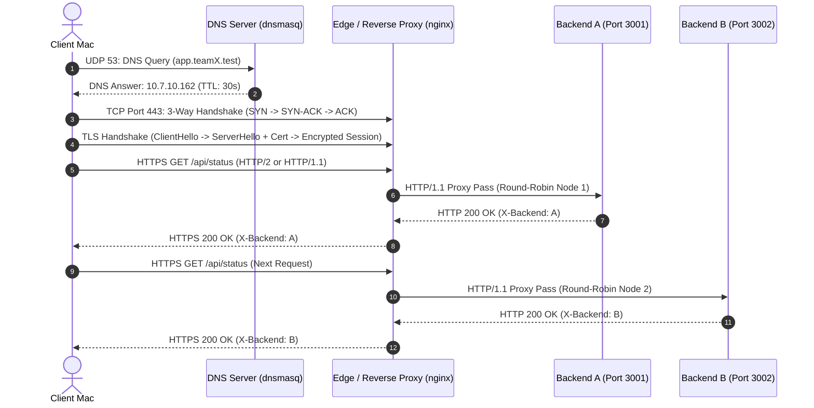

# Architecture & Network Design

## Scope

Phase 1 establishes a private, secure, and load-balanced network platform across nodes on the local area network. The system separates DNS resolution, reverse proxying / TLS termination, and backend compute nodes into distinct networked endpoints.

## Service & Node Map

| Node / Role | Hostname / ID | Address / Port | Service | Scope |
| --- | --- | --- | --- | --- |
| **DNS Server** | `cn-dns1` (Mac 1) | `10.7.7.19:53` | dnsmasq (UDP/TCP 53) | Phase 1 |
| **Edge / Load Balancer** | `cn-edge1` (Mac 2) | `10.7.10.162:443` | nginx (HTTPS / HTTP/2) | Phase 1 |
| **Backend A** | `cn-app-a` (Mac 3) | `10.7.7.19:3001` | Python REST API | Phase 1 |
| **Backend B** | `cn-app-b` (Mac 4) | `10.7.7.19:3002` | Python REST API | Phase 1 |

> Note: All nodes share the local subnet. When deployed on individual Macs, each service maps to its dedicated IP or container interface.

## Request Flow

## Protocol Layer Map

| Layer | Protocol | Role in Platform | Port / Details |
| --- | --- | --- | --- |
| **Application** | DNS | Private domain name resolution | UDP / TCP 53 (`dnsmasq`) |
| **Application** | HTTP / HTTP/2 | Application REST API & Client-Edge requests | HTTP/2, HTTP/1.1 over TLS |
| **Presentation / Security** | TLS (1.2 / 1.3) | End-to-end encryption & certificate authentication | TCP 443 |
| **Transport** | TCP | Reliable, ordered byte stream delivery | TCP 443, 3001, 3002 |
| **Network** | IP (IPv4) | Host addressing and packet routing across LAN | `10.7.7.0/24` subnet |
| **Data Link** | Ethernet / Wi-Fi | Local frame transmission | Interface `en0` / `lo0` |

## Failure Handling & Fault Tolerance (Rubric D3)

- **Backend Redundancy:** If Backend A is stopped or fails, nginx's upstream module detects the connection refusal and dynamically routes subsequent requests to Backend B without dropping client requests.
- **Independence of Layers:** A backend failure does not affect DNS resolution or the TLS transport handshake. The transport and encryption layers remain healthy while the application layer adapts.
