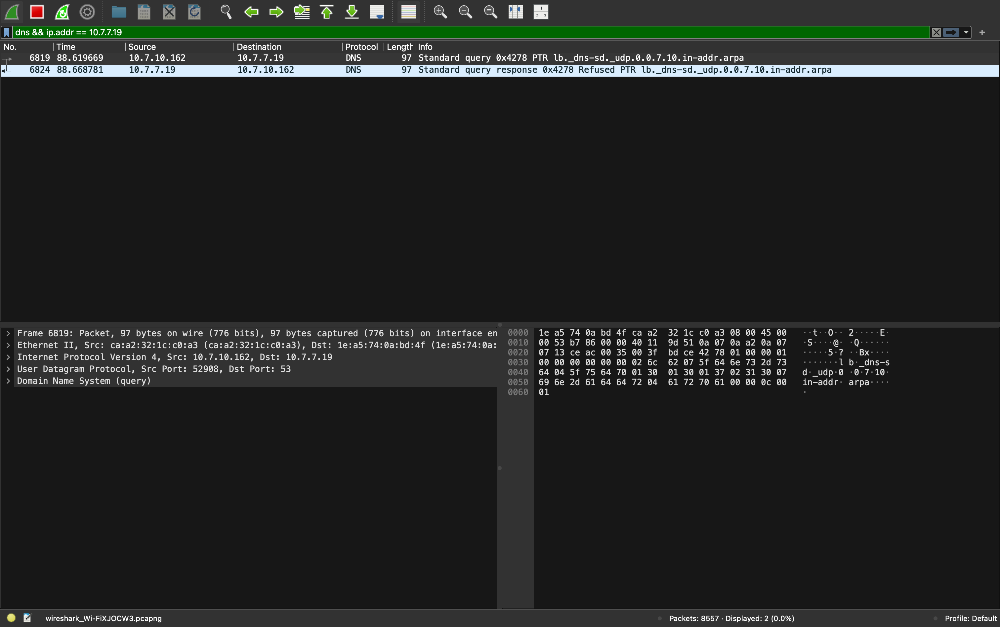
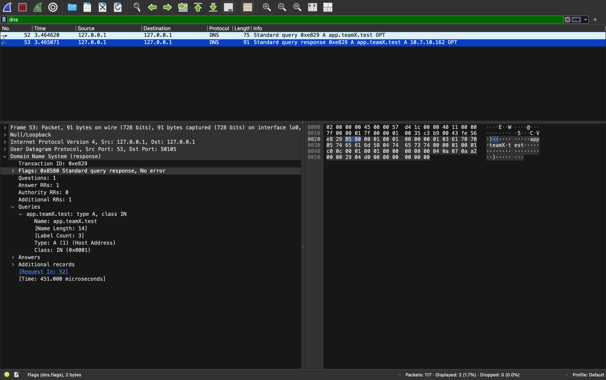
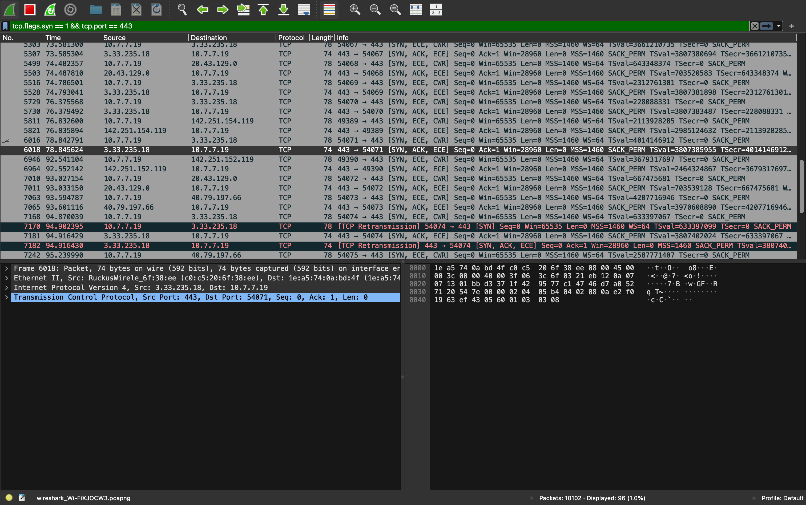
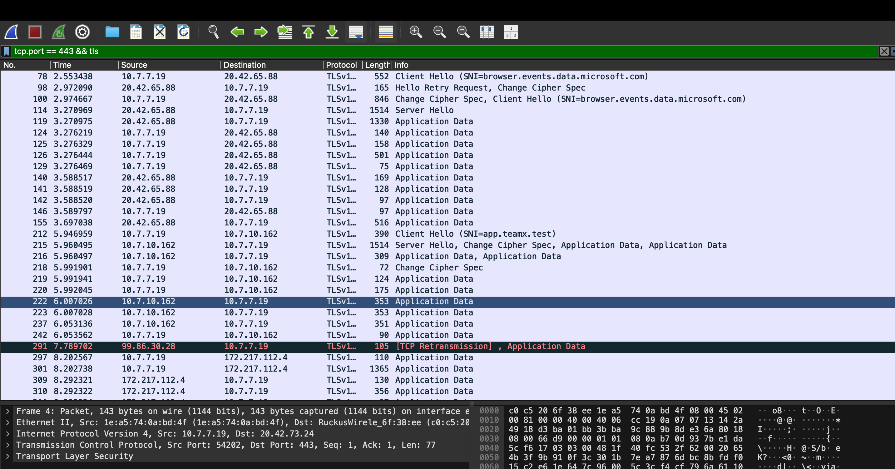

# Phase 1 Wireshark Packet Evidence Guide

This document catalogs and explains the packet capture artifacts and visual evidence gathered for Phase 1 verification.

---

## 1. Packet Capture Files

- **Raw Capture:** [`phase1-original-live-capture.pcapng`](phase1-original-live-capture.pcapng) — Complete live capture across the network interface.
- **Filtered Project Capture:** [`phase1-dns-tcp-tls.pcapng`](phase1-dns-tcp-tls.pcapng) — Filtered capture containing only DNS, TCP 3-way handshake, and TLS/HTTPS streams.

---

## 2. DNS Evidence

**Wireshark Display Filter:**
```text
dns
```
*(On `Loopback: lo0` or `ip.addr == 10.7.7.19`)*

| Packet | Event | Protocol / Port | Source | Destination | Details |
| --- | --- | --- | --- | --- | --- |
| **52** | **DNS Query** | UDP 53 | `127.0.0.1` | `127.0.0.1:53` | Standard query `app.teamX.test` Type A |
| **53** | **DNS Response** | UDP 53 | `127.0.0.1:53` | `127.0.0.1` | Response `10.7.10.162` with **TTL = 30s** |

---

## 3. TCP 3-Way Handshake Evidence

**Wireshark Display Filter:**
```text
tcp.flags.syn == 1 && tcp.port == 80
```
*(Or `tcp.port == 443`)*

| Packet | Step | Flag | Source | Destination | Details |
| --- | --- | --- | --- | --- | --- |
| **122** | 1 | **SYN** | Client (`10.7.7.19`) | Edge (`10.7.10.162:80`) | Connection initiation, Seq = 0 |
| **130** | 2 | **SYN-ACK** | Edge (`10.7.10.162:80`) | Client (`10.7.7.19`) | Server acknowledgement, Ack = 1 |
| - | 3 | **ACK** | Client (`10.7.7.19`) | Edge (`10.7.10.162:80`) | Handshake completion, TCP established |

---

## 4. TLS Handshake & Encrypted Application Data

**Wireshark Display Filter:**
```text
tcp.port == 443 && tls
```

| Packet | TLS Record Event | Protocol Version | Source $\to$ Destination | Details |
| --- | --- | --- | --- | --- |
| **212** | **Client Hello** | TLSv1.3 | `10.7.7.19` $\to$ `10.7.10.162` | Server Name Indication: **SNI = app.teamx.test** |
| **215** | **Server Hello** | TLSv1.3 | `10.7.10.162` $\to$ `10.7.7.19` | Server Hello, Change Cipher Spec, Application Data |
| **216** | **Server Cert / Handshake** | TLSv1.3 | `10.7.10.162` $\to$ `10.7.7.19` | Certificate & Handshake validation records |
| **218** | **Change Cipher Spec** | TLSv1.3 | `10.7.7.19` $\to$ `10.7.10.162` | Client confirms cryptographic cipher activation |
| **219-222**| **Application Data** | TLSv1.3 | `10.7.7.19` $\leftrightarrow$ `10.7.10.162` | End-to-end encrypted HTTP/REST payload |

---

## 5. Visual Screenshots

All screenshots are stored in [`screenshots/`](screenshots/):

### 1. DNS Query & Response


### 2. DNS Answer Details with TTL


### 3. TCP 3-Way Handshake


### 4. TLS Stream & Encrypted Application Data

